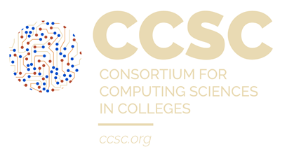
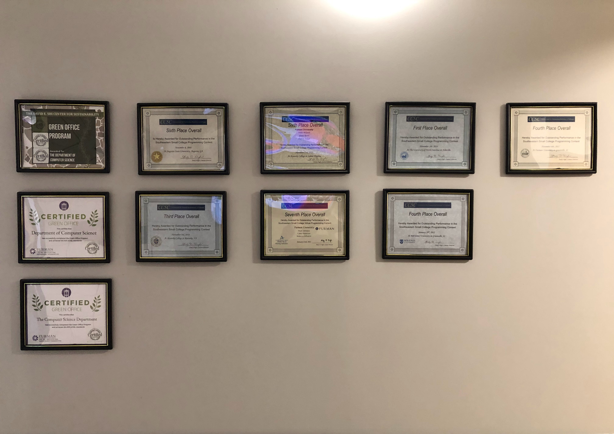

# For Fun 🤪: Programming Competitions

Programming competitions are a fun way to learn and practice problem solving skills. They are also a great way to challenge yourself and improve your programming abilities. There are many different types of programming competitions, ranging from local hackathons to international competitions with thousands of participants.

The biggest programming competition is the [International Collegiate Programming Contest (ICPC)](https://icpc.global/). ICPC is a team-based competition that challenges students to solve a series of complex problems in a limited amount of time. The competition is held annually and attracts teams from universities around the world. 

The problems in the competition are designed to test a wide range of skills, including algorithm design, data structures, and problem solving. Problems from ICPC competitions over the years can be found [here](https://icpc.global/worldfinals/past-problems). You can watch the entire 2021 ICPC World Finals on their [Youtube channel](https://www.youtube.com/@ICPCLive).

<iframe width="560" height="315" src="https://www.youtube.com/embed/an5sBhtktaE?si=xUogBETDQZXbpV1y" title="YouTube video player" frameborder="0" allow="accelerometer; autoplay; clipboard-write; encrypted-media; gyroscope; picture-in-picture; web-share" referrerpolicy="strict-origin-when-cross-origin" allowfullscreen></iframe>

Other popular programming competitions include: [Google Code Jam](https://codingcompetitions.withgoogle.com/codejam), [Facebook Hacker Cup](https://www.facebook.com/codingcompetitions/hacker-cup), [TopCoder Open](https://tco20.topcoder.com/), [AtCoder Grand Contest](https://atcoder.jp/contests/agc), and [Codeforces](https://codeforces.com/).

## CCSC:SE Programming Contest

The programming competition we will be focusing on in this course is the [Consortium for Computing Sciences in Colleges: Southeastern Conference (CCSC:SE) Programming Contest](https://ccscse.org/programming-contest/).

The Consortium for Computing Sciences in Colleges: Southeastern Conference (CCSC:SE) programming competition is an old and cherished tradition that has been going on for <u><b>over 30 years!</b></u> The contest is open to students from colleges and universities in the southeastern United States.

Furmans' own team has been competing in the contest since its inception. Following is a list of the years, the number of teams, and the winning team:

Year | Furman Standing | Total Teams | Winner
:---: | :---: | :---: | :---:
1997 | 8 | 11 | Jacksonville State
1998 | Did not compete | 21 | Georgia College and State University
1999 | Did not compete | 21 | Roanoke College
2000 | Did not compete | 21 | Taylor University
2001 | 2 | 23 | Taylor University
2002 | 7 | 28 | Mercer
2003 | 17 | 27 | Lipscomb
2004 | 3 | 19 | Mercer
2005 | 2 | 25 | Mercer
2006 | 4 | 26 | Mercer
2007 | 10 | 22 | Mercer
2008 | 6 | 20 | Bob Jones
2009 | 7 | 14 | Bob Jones
2010 | 12 | 21 | Mercer
2011 | 12 | 24 | Southern Missippi
2012 | 8 | 29 | Wofford
2013 | 13 | 30 | Wofford
2014 | 13 | 31 | Wofford
2015 | 6 | 30 | Roanoke
**2016** | 1 | 26 | **Furman**
2017 | 4 | 26 | Bob Jones
2018 | 3 | 21 | Bob Jones
2019 | 14 | 20 | Bob Jones
2020 | 7 | 29 | Bob Jones
2021 | 4 | 13 | Bob Jones
2022 | 9 | 16 | Francis Marion
2023 | 4 | 18 | Francis Marion

Some of the certificates from the contests are mounted on the wall in the Computer Science Department on thr right side of the wall facing you as you enter the department.

Note that in 30 years, Furman has won the contest only once! (in 2016). This is a record that we are not proud of and we are looking to improve it this year.

### Programming Contest Rules

During the contest the following rules will be enforced:

* To be eligible to participate, each student must be enrolled in the college for which he/she is competing.

* There will be volunteers available via a chat mechanism, who will aid in answering questions involving the contest system and will see that the contest rules are enforced.

* Contestants are allowed to utilize any printed materials, including information packets, sample programs and textbooks. Calculators are also permitted.

* Judges for the contest will be members of the Consortium for Computing in Small Colleges. The procedures for submitting and judging problems are outlined on a separate document.

* Teams will be ranked according to the number of problems solved correctly. Ties will be broken on the basis of the time required to finish and the number of judged runs.

* Programming problems will be solved and tested using each team's choice of:

    * Python using the PyCharm IDE 
    * Java using the IntelliJ IDE 
    * C++ using the VS Code IDE 
    * C# using the VS Code IDE 

* A practice session on Friday night at 6:00 will demonstrate basic logistics of the conference. It is especially important to attend this session to be familiar with the fully virtual environment this year.

* Each team are assigned an ID number and a computer. All of the computers to be used for the contest are located in the computer labs (Riley Hall). 

* All teams will be given the same problem set to solve at the outset of the contest. The problems may be solved in any order.

* There are generally <b><u>9 problems</u></b> to be solved with a time limit of <b><u>3 hours</u></b>, generally from 10 AM to 1 PM on Sunday, the last day of the conference.

* A separate work area is provided for team members who are not currently working on the computer. 

* Judging will take place in a separate area.

* An awards ceremony will be held at 1:30 PM in TBD.

<!-- 
Friday Check-In
A drop-in practice round with two problems will be held from 6:00 PM - 7:30 PM in location TBD. Each team member will have a chance to get familiar with their contest machine and submission software. (In addition, pizza will be served around 7 PM.) The contest on Saturday morning will start with a fifteen minute information session at 9:45 AM for all team members in the student work area.

Problem Submissions:

Awards:

An awards ceremony will be held during the conference wrap -up session at 1:30 PM in TBD. The top ten teams will be recognized at that time. Certificates and an engraved plaque for the top two teams will be mailed at a later date. Depending upon the level of local sponsorship, additional prizes may be awarded. These will be disbursed starting with the top team and continuing as long as prizes are available.

Meal Info

A box lunch will be provided for all contestants near the student work area in Penny Hall.

In addition, all participants are cordially invited to a pizza party on Friday, November 1. This event will take place in location TBD, and will run from 6:00 p.m. to 8:00 p.m. (overlapping with the conference banquet). Drop in any time. -->

### Judging and Scoring Rules

#### Judging Rules:

1. A team will be allowed an unlimited number of judged runs for each of the contest problems.
2. Programs will be judged right or wrong based on the specifications of the problems. Formatting of output will not be a criterion unless specifically stated.
3. During the contest, teams will receive the result (correct or incorrect) of each submission, with only the classification of any error indicated in the case of incorrect submissions.
4. Decisions of the judges are final.

#### Scoring Rules:

1. Teams will first be ranked according to the number of problems solved correctly.
2. Teams with the same number of problems correct will be ranked by increasing number of penalty points. For each correct problem the penalty point increment will be determined by:

1	point per minute to completion +	20	points 

for each incorrect submission

3. The penalty for incorrect submissions applies only to problems which are eventually solved.

### CCSC:SE Programming Contest 2024 ! 

The [Thirty-Eigth Annual CCSE: Southeastern Conference](http://ccscse.org/conference.php?year=38th) is scheduled for November 1-2, 2024 at <b><u>Furman University</u></b> ! 

Programming Contest is scheduled for 10 AM-1 PM on Saturday, November 2, 2024. It will take place in conjunction with the Consortium for Computing Sciences in Colleges: Southeastern Conference.
