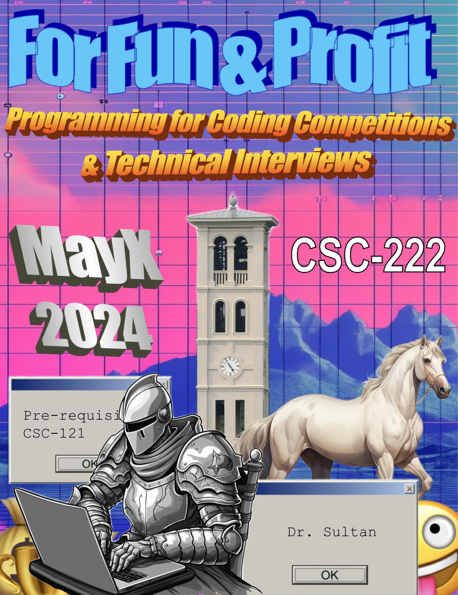

1. For Fun and Profit: Competitive Programming and Technical Interviews
{:toc}

## Meeting Times

The class meets all 5 weekdays,  <b><u>Monday through Friday</u></b>, for 3 hours each day from <u><b>9:30 AM - 12:30 PM</b></u>.

The course is comprised of **15 meetings** from **May 8th - May 29th**, 2024.

<!-- There will be **no meeting** on **Memorial Day** on May 27th, 2024. -->

Each class would contain at least one computer programming problem. Students are expected to turn in at least 80% of the in-class problems within one hour maximum of the end of the class duration. 

## Grading

The breakdown of the course grade is as follows:

* 30 % - Attendance (2 per meeting)
* 30 % - Class Participation + in-class problem solving (2 per meeting)
* 20 % - Assignments: out-of-class problems
* 10 % - Mock interviews (May 27th - May 28th)
* 10 % - Programming Competition (May 29th)

To get a passing grade, students muse be present for at least 13 of the 15 classes scheduled for MayX.  

Grade Scale:

* A: 90-100
* B: 80-89
* C: 70-79
* D: 60-69
* F: 0-59

+/- grades will be assigned at the instructor's discretion.

## Prerequisites

**CSC-121**: Introduction to Computer Programming
 
## Number of credits
2 credits 

## Course Description

This course is designed to prepare students for [Programming Competitions](fun.html) and [Coding Interviews](profit.html). Every meeting will include a problem solving session where students will be expected to solve problems in a limited time frame. The problems will be selected from previous national and regional competitions and commonly given problems in technical interviews. The instructor will provide guidance and feedback to the teams after the problem solving sessions. The class is going to be modelled as a course-length tournament and/or game show. Students will also be expected to complete assignments for practice and to participate in external programming contests and mock coding interviews. 

## Course Objectives

1. Broadly enhance student abilities in programming under time constraints.
2. Prepare students to compete in national and regional programming competitions 
3. Help students prepare for technical interviews in their job search 

## Learning Outcomes

1. Develop and sharpen problem solving skills
2. Solving a wide breadth of problems using a variety of algorithmic strategies 
3. Learning to effectively communicate understanding and solution to a problem
4. Demonstrating the ability to improvise and think quickly on their feet 
5. The ability to work effectively in a team and collaborate with others towards solving a problem

## Resources

* Programming Interviews: **[LeetCode](https://leetcode.com/)**

* Programming Competitions: **[CCSC Problems](http://ccscse.org/programming_contest/problems/)**

## Textbooks  
List possible text(s) by author and title:

* [Competitive Programmer's Handbook](https://cses.fi/book/book.pdf) by Antti Laaksonen

* Guide to Competitive Programming: Learning and Improving Algorithms Through Contests (Undergraduate Topics in Computer Science) 2nd ed. 2020 Edition by Antti Laaksonen

* Cracking the Coding Interview: 189 Programming Questions and Solutions 6th Edition by Gayle Laakmann McDowell 

* Programming Challenges: The Programming Contest Training Manual (Texts in Computer Science) Paperback – January 1, 2003 by Steven S. Skiena, Miguel A. Revilla 

* Competitive Programming in Python 1st Edition by Christoph Dürr

* Competitive Programming 4 - Book 2 Paperback – July 18, 2020 by Steven Halim
 

Leet code Premium membership for all students (35 USD a month) for duration of the semester

## Similar Courses at other universities

- [Programming Problems](http://ccscse.org/programming_contest/problems/) from **SIGCSE: SE** competition in the past years. 

- [Competitive Programming](https://luddy.iupui.edu/degrees/courses/csci-b392) at **University of Indiana**

- [Competitive Programming Essentials, Master Algorithms 2023](https://www.udemy.com/course/competitive-programming-algorithms-coding-minutes/) at **Udemy**

* [Competitive Programming](https://www.cs.purdue.edu/homes/ninghui/courses/cp_resources.html) at **Purdue**. 

* [CSE 300X - Programming Challenges](https://www3.cs.stonybrook.edu/~skiena/392/) at **Stonybrook University**.

* [CS 491: Advanced Competitive Programming](https://cs.illinois.edu/academics/courses/cs491cap) at **UIUC**.

* [CS 97SI: Introduction to Programming Contests](https://web.stanford.edu/class/cs97si/) at **Stanford**.

* [15-295: Competitive Programming and Problem Solving](https://contest.cs.cmu.edu/295/) at **Carnegie Mellon**.

* [CS104c: Competitive Programming](https://www.cs.utexas.edu/users/downing/cs104c/) at **University of Texas, Austin**.

* [CS3233: Competitive Programming](https://nusmods.com/courses/CS3233/competitive-programming) at **NUS**.

## Me teaching this (or any) course 

I am making this up as I go along. 

I have never taught this course before. I have never taken this course before. For what it's worth, my PhD advisor Dr. Steven Skiena led the [Stony Brook team](https://www3.cs.stonybrook.edu/~compprog) for many years and even wrote a [textbook](https://www.amazon.com/Programming-Challenges-Contest-Training-Computer/dp/0387001638/) on the subject. The Stony Brook team frequently qualifies for the North American Championship. I have seen Dr. Skiena's process a little bit and I am going to try to emulate that here at Furman. 

<iframe src="https://giphy.com/embed/3oz8xtBx06mcZWoNJm" width="480" height="362" frameBorder="0" class="giphy-embed" allowFullScreen></iframe>
<a href="https://giphy.com/gifs/aardman-cartoon-train-3oz8xtBx06mcZWoNJm">via GIPHY</a>

Everything is tentative and subject to change

<!--  -->

This is my first teaching this course. Any and all feedback is welcome!

I have created an anonymous feedback poll on Moodle. Please use this to anonymously share any feedback.

Share any changes you want me to make in the course, at any point in the semester. You can submit multiple times over the span of the semester.

Think of it as a Complaints Box 🗳️ for the course.

## Poster 

